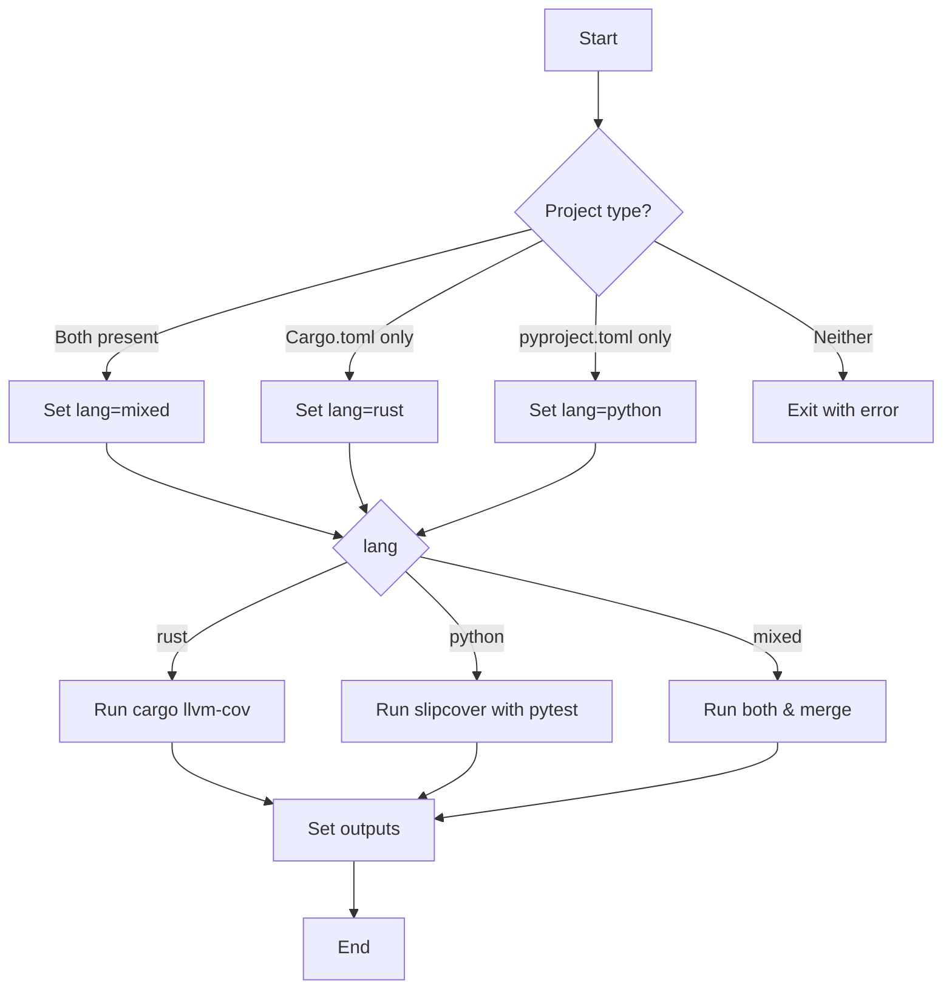

# Generate coverage

Run coverage for Rust, Python, or mixed Rust+Python projects.

Run code coverage for Rust projects, Python projects, and mixed Rust + Python
projects. The action uses `cargo llvm-cov` when a `Cargo.toml` is present and
`slipcover` with `pytest` when a `pyproject.toml` is present. It installs
`slipcover` and `pytest` automatically via `uv` before running the tests. When
Rust coverage is required, `cargo-llvm-cov` is installed automatically as well.
If both configuration files are present, coverage is run for each language and
the Cobertura reports are merged using `uvx merge-cobertura`.

## Flow



## Inputs

| Name | Description | Required | Default |
| --- | --- | --- | --- |
| features | Enable Cargo (Rust) features; space- or comma-separated. | no | |
| with-default-features | Enable default Cargo features (Rust) | no | `true` |
| output-path | Output file path | yes | |
| format | Formats: `lcov`*, `cobertura`, `coveragepy`* | no | `cobertura` |
| with-ratchet | Fail if coverage drops below baseline | no | `false` |
| baseline-rust-file | Rust baseline path | no | `.coverage-baseline.rust` |
<!-- markdownlint-disable-next-line MD013 -->
| baseline-python-file | Python baseline path | no | `.coverage-baseline.python` |
| with-cucumber-rs | Run cucumber-rs scenarios under coverage | no | `false` |
| cucumber-rs-features | Path to cucumber feature files | no | |
| cucumber-rs-args | Extra arguments for cucumber | no | |
| artifact-extra-suffix | Extra suffix appended to coverage artifacts after the `<os>-<arch>` segment. Useful for differentiating nightly/regional jobs. | no | |

\* `lcov` is only supported for Rust projects, while `coveragepy` is only
supported for Python projects. Mixed projects must use `cobertura`.

## Outputs

| Name   | Description                                     |
| ------ | ----------------------------------------------- |
| file   | Path to the generated coverage file             |
| format | Format of the coverage file                     |
| lang   | Detected language (`rust`, `python` or `mixed`) |
| artifact-name | Coverage artifact name with OS/arch and optional custom suffix |

## Example

```yaml
- uses: ./.github/actions/generate-coverage@v1
  with:
    output-path: coverage.xml
    format: cobertura
```

For a single feature:

```yaml
- uses: ./.github/actions/generate-coverage@v1
  with:
    output-path: coverage.xml
    features: logging
```

For multiple features:

```yaml
- uses: ./.github/actions/generate-coverage@v1
  with:
    output-path: coverage.xml
    features: logging tracing
    with-default-features: false
```

Comma-separated feature list:

```yaml
- uses: ./.github/actions/generate-coverage@v1
  with:
    output-path: coverage.xml
    features: logging,tracing
```

Enable ratcheting:

```yaml
- uses: ./.github/actions/generate-coverage@v1
  with:
    output-path: coverage.xml
    with-ratchet: true
```

Enable cucumber-rs:

```yaml
- uses: ./.github/actions/generate-coverage@v1
  with:
    output-path: coverage.xml
    with-cucumber-rs: true
    cucumber-rs-features: tests/features
    cucumber-rs-args: "--tag @ui"
```

The action prints the current coverage percentage to the log. When
``with-ratchet`` is enabled and a baseline file is present, the previous
percentage is shown as well.

Coverage reports are archived as workflow artifacts named
``<format>-<job>-<index>-<os>-<arch>``. When `artifact-extra-suffix` is set, the
sanitised suffix is appended to that pattern, ensuring artifacts from different
platforms or channels remain unique across matrix jobs.

Release history is available in [CHANGELOG](CHANGELOG.md).
