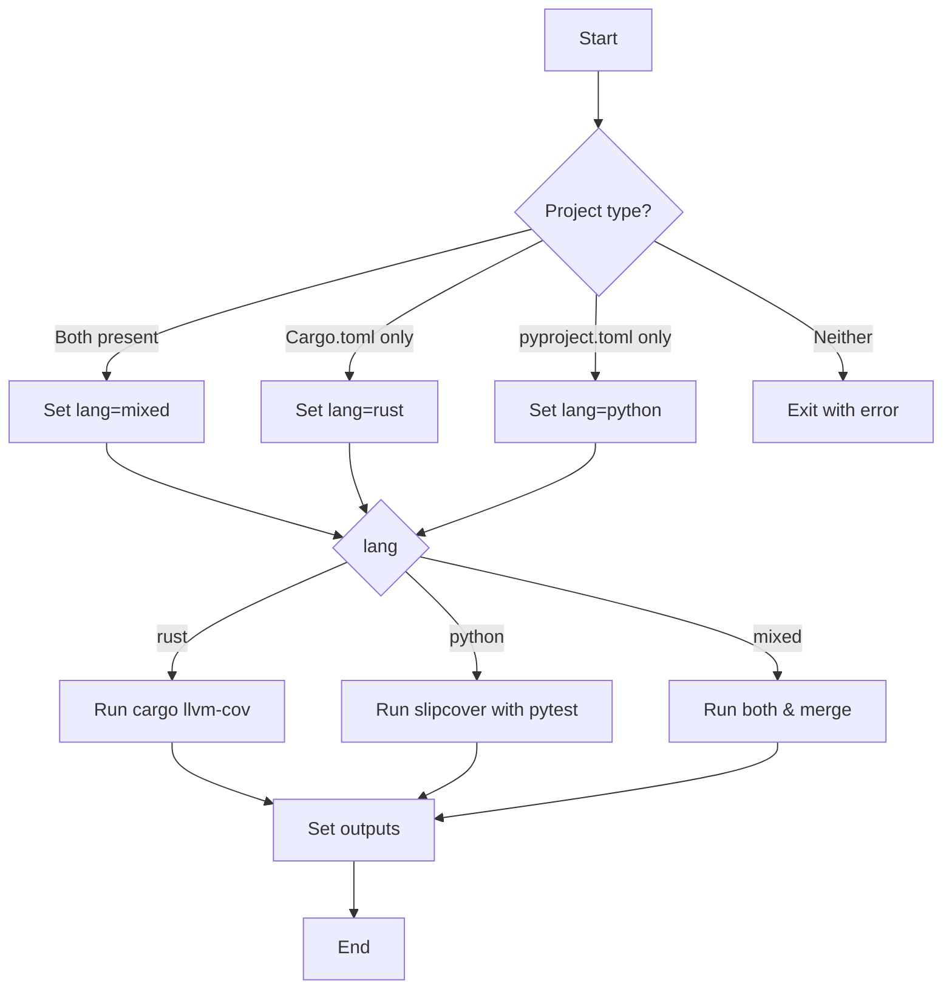

# Generate coverage

Run code coverage for Rust projects, Python projects, and mixed Rust + Python projects. The action uses
`cargo llvm-cov` when a `Cargo.toml` is present and `slipcover` with
`pytest` when a `pyproject.toml` is present. It installs `slipcover` and
`pytest` automatically via `uv` before running the tests. If both
configuration files are present, coverage is run for each language and
the Cobertura reports are merged using `uvx merge-cobertura`.

## Flow



## Inputs

| Name | Description | Required | Default |
| --- | --- | --- | --- |
| features | Cargo features to enable (Rust). Separate multiple features with spaces or commas. | no | |
| with-default-features | Enable default Cargo features (Rust) | no | `true` |
| output-path | Output file path | yes | |
| format | Coverage format (`lcov`*, `cobertura` or `coveragepy`*) | no | `cobertura` |

\* `lcov` is only supported for Rust projects, while `coveragepy` is only supported for Python projects. Mixed projects must use `cobertura`.

## Outputs

| Name | Description |
| --- | --- |
| file | Path to the generated coverage file |
| format | Format of the coverage file |
| lang | Detected language (`rust`, `python` or `mixed`) |

## Example

```yaml
- uses: ./.github/actions/generate-coverage@v1
  with:
    output-path: coverage.xml
    format: cobertura
```

For a single feature:

```yaml
- uses: ./.github/actions/generate-coverage@v1
  with:
    output-path: coverage.xml
    features: logging
```

For multiple features:

```yaml
- uses: ./.github/actions/generate-coverage@v1
  with:
    output-path: coverage.xml
    features: logging tracing
    with-default-features: false
```

Comma-separated feature list:

```yaml
- uses: ./.github/actions/generate-coverage@v1
  with:
    output-path: coverage.xml
    features: logging,tracing
```

Release history is available in [CHANGELOG](CHANGELOG.md).
