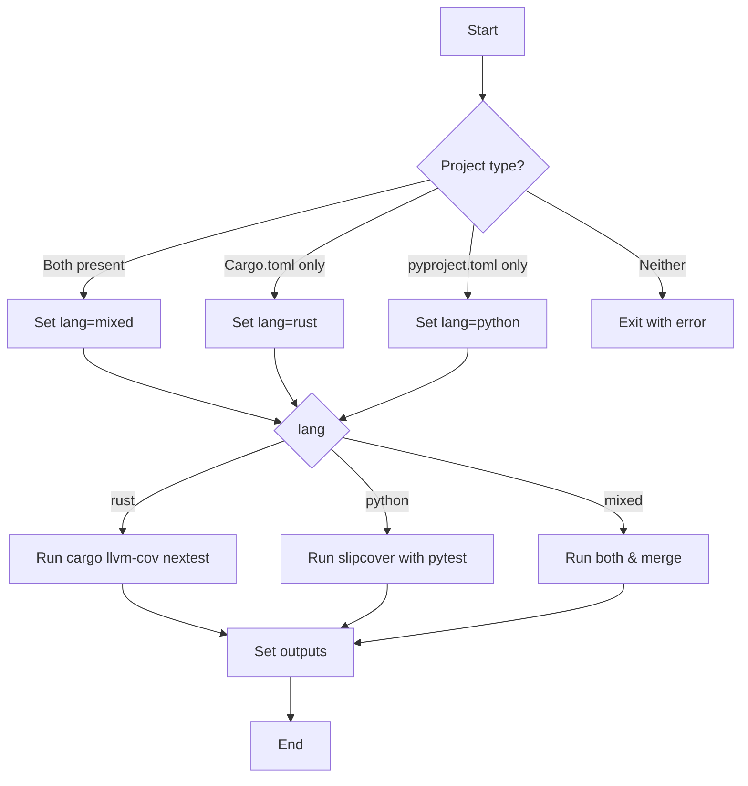
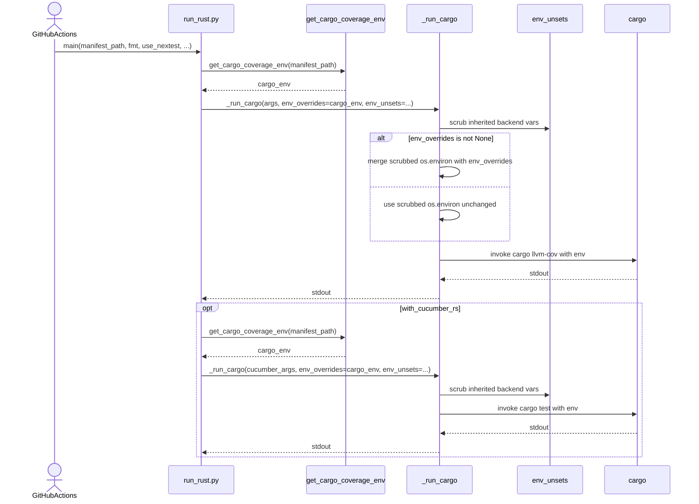

# Generate coverage

Run coverage for Rust, Python, or mixed Rust+Python projects.

Run code coverage for Rust projects, Python projects, and mixed Rust + Python
projects. The action uses `cargo llvm-cov` (with `cargo nextest` by default)
when a `Cargo.toml` is present and `slipcover` with `pytest` when a
`pyproject.toml` is present. If the repository root does not contain a Cargo
manifest, set `cargo-manifest` to point to a nested `Cargo.toml`. It installs
`slipcover` and `pytest` automatically via `uv` before running the tests,
leveraging ``uv run --with`` so no system-level Python installs are required.
When Rust coverage is required, `cargo-llvm-cov` and `cargo-nextest` are
installed automatically. If both configuration files are present, coverage is
run for each language and the Cobertura reports are merged using
`uvx merge-cobertura`.

## Flow


```mermaid
flowchart TD
    A[Start] --> B{Project type?}
    B -- Both present --> C[Set lang=mixed]
    B -- Cargo.toml only --> D[Set lang=rust]
    B -- pyproject.toml only --> E[Set lang=python]
    B -- Neither --> F[Exit with error]
    C --> G{lang}
    D --> G
    E --> G
    G -- rust --> H[Run cargo llvm-cov nextest]
    G -- python --> I[Run slipcover with pytest]
    G -- mixed --> J[Run both & merge]
    H --> K[Set outputs]
    I --> K
    J --> K
    K --> L[End]
```

## Rust coverage environment propagation

Figure: sequence diagram showing how `run_rust.py` derives coverage-specific
Cargo environment overrides for Cranelift-configured projects and passes them
into `_run_cargo`, including the optional cucumber.rs follow-up run. Internally
`_run_cargo` starts from the current process environment, removes inherited
codegen-backend-related variables first, and then merges
`get_cargo_coverage_env(manifest_path)` on top so workflow-level Cranelift
exports are not treated as the default coverage behaviour.


```mermaid
sequenceDiagram
    actor GitHubActions
    participant run_rust_py as run_rust.py
    participant get_cargo_coverage_env
    participant _run_cargo
    participant env_unsets
    participant cargo

    GitHubActions->>run_rust_py: main(manifest_path, fmt, use_nextest, ...)
    run_rust_py->>get_cargo_coverage_env: get_cargo_coverage_env(manifest_path)
    get_cargo_coverage_env-->>run_rust_py: cargo_env
    run_rust_py->>_run_cargo: _run_cargo(args, env_overrides=cargo_env, env_unsets=...)
    _run_cargo->>env_unsets: scrub inherited backend vars
    alt env_overrides is not None
        _run_cargo->>_run_cargo: merge scrubbed os.environ with env_overrides
    else
        _run_cargo->>_run_cargo: use scrubbed os.environ unchanged
    end
    _run_cargo->>cargo: invoke cargo llvm-cov with env
    cargo-->>_run_cargo: stdout
    _run_cargo-->>run_rust_py: stdout

    opt with_cucumber_rs
        run_rust_py->>get_cargo_coverage_env: get_cargo_coverage_env(manifest_path)
        get_cargo_coverage_env-->>run_rust_py: cargo_env
        run_rust_py->>_run_cargo: _run_cargo(cucumber_args, env_overrides=cargo_env, env_unsets=...)
        _run_cargo->>env_unsets: scrub inherited backend vars
        _run_cargo->>cargo: invoke cargo test with env
        cargo-->>_run_cargo: stdout
        _run_cargo-->>run_rust_py: stdout
    end
```

## Cranelift codegen backend support

The action automatically detects when a Rust repository configures the
Cranelift codegen backend in `.cargo/config.toml`, `.cargo/config`, or the
selected `Cargo.toml` profile sections. You do not need to enable a separate
input for this behaviour.

When Cranelift is detected, coverage runs set
`CARGO_PROFILE_DEV_CODEGEN_BACKEND=llvm` and
`CARGO_PROFILE_TEST_CODEGEN_BACKEND=llvm` as environment overrides before
launching `cargo-llvm-cov`. That ensures nested `cargo` processes inherit LLVM,
which is required by `-Cinstrument-coverage`. Normal non-coverage builds are
not changed by the action.

For a Cranelift-configured repository, the standard coverage invocation is
still enough:

```yaml
- uses: ./.github/actions/generate-coverage
  with:
    output-path: coverage.xml
    format: cobertura
```

```yaml
- uses: leynos/shared-actions/.github/actions/generate-coverage@v1
  with:
    output-path: coverage.xml
    format: cobertura
```

Known limitations:

- Profile sections in the workspace root `Cargo.toml` are only detected when
  `cargo-manifest` points to the workspace root manifest. If `cargo-manifest`
  points to a workspace member, Cranelift configured solely in the workspace
  root manifest profile will not be detected; use `.cargo/config.toml` in that
  case.
- Detection uses two approaches: `.cargo/config.toml` and `.cargo/config`
  scanning remains text/regex-based, and selected `Cargo.toml` profile
  detection also uses a lightweight text scan.

## Inputs

| Name | Description | Required | Default |
| --- | --- | --- | --- |
| features | Enable Cargo (Rust) features; space- or comma-separated. | no | |
| with-default-features | Enable default Cargo features (Rust) | no | `true` |
| cargo-manifest | Optional path to Cargo.toml if root Cargo.toml is missing | no | |
| use-cargo-nextest | Use cargo-nextest for Rust coverage runs (default); set to `false` to use `cargo llvm-cov` directly | no | `true` |
| output-path | Output file path | yes | |
| format | Formats: `lcov`*, `cobertura`, `coveragepy`* | no | `cobertura` |
| with-ratchet | Fail if coverage drops below baseline | no | `false` |
| artefact-name-suffix | Additional suffix appended to the uploaded coverage artefact | no | |
| baseline-rust-file | Rust baseline path | no | `.coverage-baseline.rust` |
<!-- markdownlint-disable-next-line MD013 -->
| baseline-python-file | Python baseline path | no | `.coverage-baseline.python` |
| with-cucumber-rs | Run cucumber-rs scenarios under coverage | no | `false` |
| cucumber-rs-features | Path to cucumber feature files | no | |
| cucumber-rs-args | Extra arguments for cucumber | no | |

\* `lcov` is only supported for Rust projects, while `coveragepy` is only
supported for Python projects. Mixed projects must use `cobertura`.

## Outputs

| Name   | Description                                     |
| ------ | ----------------------------------------------- |
| file   | Path to the generated coverage file             |
| format | Format of the coverage file                     |
| lang   | Detected language (`rust`, `python` or `mixed`) |

## Example

```yaml
- uses: ./.github/actions/generate-coverage
  with:
    output-path: coverage.xml
    format: cobertura
```

```yaml
- uses: leynos/shared-actions/.github/actions/generate-coverage@v1
  with:
    output-path: coverage.xml
    format: cobertura
```

For a single feature:

```yaml
- uses: ./.github/actions/generate-coverage
  with:
    output-path: coverage.xml
    features: logging
```

For multiple features:

```yaml
- uses: ./.github/actions/generate-coverage
  with:
    output-path: coverage.xml
    features: logging tracing
    with-default-features: false
```

Comma-separated feature list:

```yaml
- uses: ./.github/actions/generate-coverage
  with:
    output-path: coverage.xml
    features: logging,tracing
```

Enable ratcheting:

```yaml
- uses: ./.github/actions/generate-coverage
  with:
    output-path: coverage.xml
    with-ratchet: true
```

Enable cucumber-rs:

```yaml
- uses: ./.github/actions/generate-coverage
  with:
    output-path: coverage.xml
    with-cucumber-rs: true
    cucumber-rs-features: tests/features
    cucumber-rs-args: "--tag @ui"
```

Disable cargo-nextest:

```yaml
- uses: ./.github/actions/generate-coverage
  with:
    output-path: coverage.xml
    use-cargo-nextest: false
```

Use a nested Cargo manifest:

```yaml
- uses: ./.github/actions/generate-coverage
  with:
    output-path: coverage.xml
    cargo-manifest: rust-toy-app/Cargo.toml
```

The action prints the current coverage percentage to the log. When
``with-ratchet`` is enabled and a baseline file is present, the previous
percentage is shown as well.

Coverage reports are archived as workflow artefacts named
``<format>-<job>-<index>-<os>-<arch>`` by default. When
`artefact-name-suffix` is provided, the suffix is appended after the
`<os>-<arch>` segment. This prevents collisions across matrix jobs and
distinguishes runs on different platforms.

Developer-facing design notes, including the rationale for Cranelift coverage
environment overrides, are available in
[`docs/generate-coverage-design.md`](../../../docs/generate-coverage-design.md).

Release history is available in [CHANGELOG](CHANGELOG.md).
