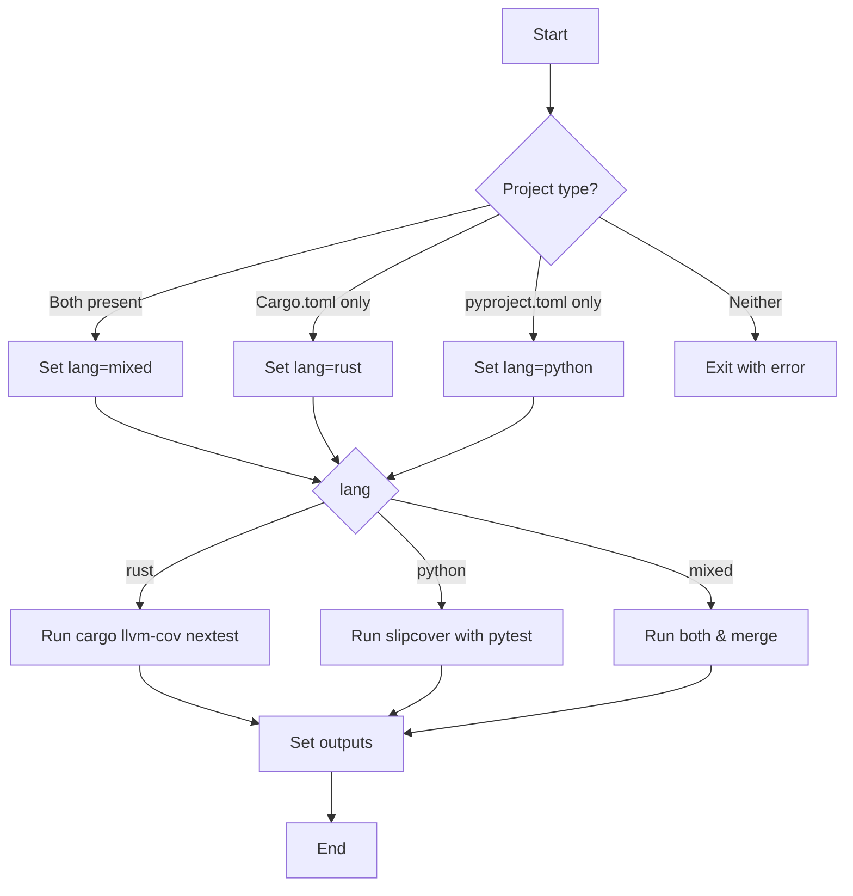
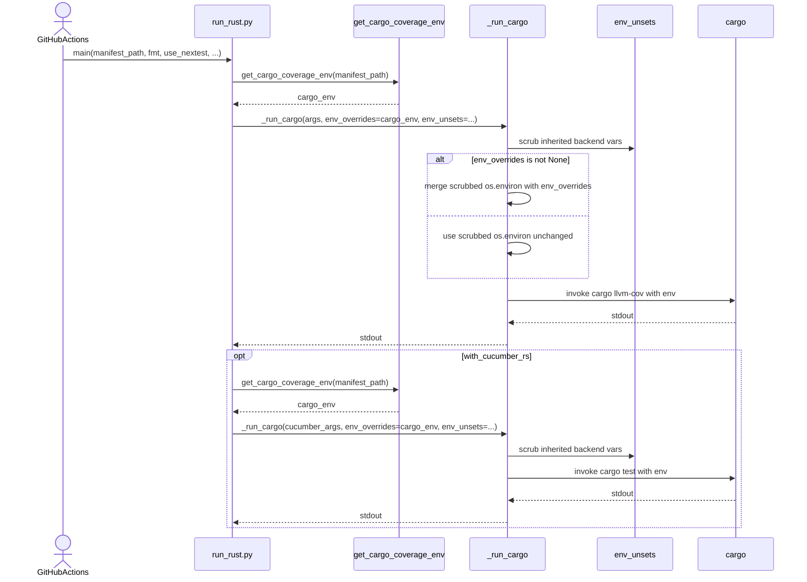

# Generate coverage

Run coverage for Rust, Python, or mixed Rust+Python projects.

Run code coverage for Rust projects, Python projects, and mixed Rust + Python
projects. The action uses `cargo llvm-cov` (with `cargo nextest` by default)
when a `Cargo.toml` is present and `slipcover` with `pytest` when a
`pyproject.toml` is present. If the repository root does not contain a Cargo
manifest, set `cargo-manifest` to point to a nested `Cargo.toml`. It installs
the project dependencies plus `slipcover`, `pytest`, and `coverage`
automatically via `uv` into an isolated throwaway virtual environment
(`.venv-coverage`) before running the tests, so no system-level Python installs
are required. When Rust coverage is required, `cargo-llvm-cov` and
`cargo-nextest` are installed automatically via a pinned `cargo-binstall`. The
action provisions a specific `cargo-binstall` version — reusing a cached build
when its version matches exactly, otherwise installing it from a
checksum-verified installer script — and verifies the resolved version before
running the coverage tooling. If both configuration files are present, coverage
is run for each language and the Cobertura reports are merged using
`uvx merge-cobertura`.

## Flow


```mermaid
flowchart TD
    A[Start] --> B{Project type?}
    B -- Both present --> C[Set lang=mixed]
    B -- Cargo.toml only --> D[Set lang=rust]
    B -- pyproject.toml only --> E[Set lang=python]
    B -- Neither --> F[Exit with error]
    C --> G{lang}
    D --> G
    E --> G
    G -- rust --> H[Run cargo llvm-cov nextest]
    G -- python --> I[Run slipcover with pytest]
    G -- mixed --> J[Run both & merge]
    H --> K[Set outputs]
    I --> K
    J --> K
    K --> L[End]
```

## Rust coverage environment propagation

Figure: sequence diagram showing how `run_rust.py` derives coverage-specific
Cargo environment overrides for Cranelift-configured projects and passes them
into `_run_cargo`, including the optional cucumber.rs follow-up run. Internally
`_run_cargo` starts from the current process environment, removes inherited
codegen-backend-related variables first, and then merges
`get_cargo_coverage_env(manifest_path)` on top so workflow-level Cranelift
exports are not treated as the default coverage behaviour.

<!-- markdownlint-disable MD013 -->

```mermaid
sequenceDiagram
    actor GitHubActions
    participant run_rust_py as run_rust.py
    participant get_cargo_coverage_env
    participant _run_cargo
    participant env_unsets
    participant cargo

    GitHubActions->>run_rust_py: main(manifest_path, fmt, use_nextest, ...)
    run_rust_py->>get_cargo_coverage_env: get_cargo_coverage_env(manifest_path)
    get_cargo_coverage_env-->>run_rust_py: cargo_env
    run_rust_py->>_run_cargo: _run_cargo(args, env_overrides=cargo_env, env_unsets=...)
    _run_cargo->>env_unsets: scrub inherited backend vars
    alt env_overrides is not None
        _run_cargo->>_run_cargo: merge scrubbed os.environ with env_overrides
    else
        _run_cargo->>_run_cargo: use scrubbed os.environ unchanged
    end
    _run_cargo->>cargo: invoke cargo llvm-cov with env
    cargo-->>_run_cargo: stdout
    _run_cargo-->>run_rust_py: stdout

    opt with_cucumber_rs
        run_rust_py->>get_cargo_coverage_env: get_cargo_coverage_env(manifest_path)
        get_cargo_coverage_env-->>run_rust_py: cargo_env
        run_rust_py->>_run_cargo: _run_cargo(cucumber_args, env_overrides=cargo_env, env_unsets=...)
        _run_cargo->>env_unsets: scrub inherited backend vars
        _run_cargo->>cargo: invoke cargo test with env
        cargo-->>_run_cargo: stdout
        _run_cargo-->>run_rust_py: stdout
    end
```
<!-- markdownlint-enable MD013 -->

## Cranelift codegen backend support

The action automatically detects when a Rust repository configures the
Cranelift codegen backend in `.cargo/config.toml`, `.cargo/config`, or the
selected `Cargo.toml` profile sections. You do not need to enable a separate
input for this behaviour.

When Cranelift is detected, coverage runs set
`CARGO_PROFILE_DEV_CODEGEN_BACKEND=llvm` and
`CARGO_PROFILE_TEST_CODEGEN_BACKEND=llvm` as environment overrides before
launching `cargo-llvm-cov`. That ensures nested `cargo` processes inherit LLVM,
which is required by `-Cinstrument-coverage`. Normal non-coverage builds are
not changed by the action.

For a Cranelift-configured repository, the standard coverage invocation is
still enough:

```yaml
- uses: ./.github/actions/generate-coverage
  with:
    output-path: coverage.xml
    format: cobertura
```

```yaml
- uses: leynos/shared-actions/.github/actions/generate-coverage@v1
  with:
    output-path: coverage.xml
    format: cobertura
```

Known limitations:

- Profile sections in the workspace root `Cargo.toml` are only detected when
  `cargo-manifest` points to the workspace root manifest. If `cargo-manifest`
  points to a workspace member, Cranelift configured solely in the workspace
  root manifest profile will not be detected; use `.cargo/config.toml` in that
  case.
- Detection uses two approaches: `.cargo/config.toml` and `.cargo/config`
  scanning remains text/regex-based, and selected `Cargo.toml` profile
  detection also uses a lightweight text scan.

## Inputs

<!-- markdownlint-disable MD013 -->
| Name | Description | Required | Default |
| --- | --- | --- | --- |
| features | Enable Cargo (Rust) features; space- or comma-separated. | no | |
| with-default-features | Enable default Cargo features (Rust) | no | `true` |
| language | Coverage language scope: `auto`, `rust`, `python`, or `mixed`. `auto` keeps manifest-based detection; explicit values force the scope and fail fast when its prerequisites are missing. See below. | no | `auto` |
| cargo-manifest | Optional path to Cargo.toml if root Cargo.toml is missing | no | |
| use-cargo-nextest | Use cargo-nextest for Rust coverage runs (default); set to `false` to use `cargo llvm-cov` directly | no | `true` |
| output-path | Output file path | yes | |
| format | Formats: `lcov`*, `cobertura`, `coveragepy`* | no | `cobertura` |
| with-ratchet | Fail if coverage drops more than 1pp below baseline | no | `false` |
| artefact-name-suffix | Additional suffix appended to the uploaded coverage artefact | no | |
| baseline-rust-file | Rust baseline path | no | `.coverage-baseline.rust` |
| baseline-python-file | Python baseline path | no | `.coverage-baseline.python` |
| with-cucumber-rs | Run cucumber-rs scenarios under coverage | no | `false` |
| cucumber-rs-features | Path to cucumber feature files | no | |
| cucumber-rs-args | Extra arguments for cucumber | no | |
| pytest-workers | Value passed to pytest-xdist's `-n` flag. Accepts a positive integer, `auto`, `logical`, or `""` (empty) to disable parallelism. | no | `auto` |
<!-- markdownlint-enable MD013 -->

\* `lcov` is only supported for Rust projects, while `coveragepy` is only
supported for Python projects. Mixed projects must use `cobertura`.

### Selecting the coverage language

By default (`language: auto`) the action infers the scope from the manifests
present: a root `Cargo.toml` means Rust, a root `pyproject.toml` means Python,
and both together mean mixed. This inference treats *any* `pyproject.toml` as a
Python project, including a configuration-only one that exists solely to hold
tooling settings (for example Ruff, Pylint, or ty) with no `[project]` table.

Set `language` explicitly to force the scope and skip that inference:

- `rust` requires a resolved Cargo manifest (root `Cargo.toml` or
  `cargo-manifest`) and **ignores** a configuration-only `pyproject.toml`.
- `python` requires a syncable `pyproject.toml` with a `[project]` table (the
  prerequisite for the action's `uv sync`).
- `mixed` requires both of the above.

Explicit values fail fast with a clear error when their prerequisites are
absent.

Use `language: rust` for a Rust repository that keeps a tooling-only
`pyproject.toml` (so `auto` would otherwise misclassify it as mixed and reject
`lcov`):

```yaml
- uses: leynos/shared-actions/.github/actions/generate-coverage@v1
  with:
    language: rust
    output-path: lcov.info
    format: lcov
```

## Outputs

| Name   | Description                                     |
| ------ | ----------------------------------------------- |
| file   | Path to the generated coverage file             |
| format | Format of the coverage file                     |
| lang   | Detected language (`rust`, `python` or `mixed`) |

## Example

```yaml
- uses: ./.github/actions/generate-coverage
  with:
    output-path: coverage.xml
    format: cobertura
```

```yaml
- uses: leynos/shared-actions/.github/actions/generate-coverage@v1
  with:
    output-path: coverage.xml
    format: cobertura
```

For a single feature:

```yaml
- uses: ./.github/actions/generate-coverage
  with:
    output-path: coverage.xml
    features: logging
```

For multiple features:

```yaml
- uses: ./.github/actions/generate-coverage
  with:
    output-path: coverage.xml
    features: logging tracing
    with-default-features: false
```

Comma-separated feature list:

```yaml
- uses: ./.github/actions/generate-coverage
  with:
    output-path: coverage.xml
    features: logging,tracing
```

Enable ratcheting:

```yaml
- uses: ./.github/actions/generate-coverage
  with:
    output-path: coverage.xml
    with-ratchet: true
```

The ratchet compares the current coverage against a stored baseline within a
provisional symmetric ±1 percentage-point dead-band. Coverage within one
absolute percentage point of the baseline is treated as noise: the run passes
and the baseline is held. A drop of more than one point below the baseline
fails the run; a rise of more than one point above the baseline advances the
baseline. On pushes to the default branch the advanced baseline is persisted to
the Actions cache and restored on subsequent runs, so the baseline tracks the
latest default-branch coverage.

Enable cucumber-rs:

```yaml
- uses: ./.github/actions/generate-coverage
  with:
    output-path: coverage.xml
    with-cucumber-rs: true
    cucumber-rs-features: tests/features
    cucumber-rs-args: "--tag @ui"
```

Disable cargo-nextest:

```yaml
- uses: ./.github/actions/generate-coverage
  with:
    output-path: coverage.xml
    use-cargo-nextest: false
```

Run pytest serially (disable pytest-xdist):

```yaml
- uses: ./.github/actions/generate-coverage
  with:
    output-path: coverage.xml
    pytest-workers: ""
```

### Parallel Python tests via pytest-xdist

Python coverage runs through `pytest-xdist` by default
(`pytest-workers: auto`), and slipcover 1.0.18+ merges the per-worker coverage
transparently. Set `pytest-workers` to a positive integer for a fixed worker
count, to `logical` to use the logical central processing unit (CPU) count, or
to `""` to keep the historical serial behaviour.

> [!WARNING]
> **Co-located tests + `--omit` regression in slipcover xdist workers.**
> slipcover 1.0.18's xdist plugin does not propagate `--omit` to worker
> processes. Projects that lay tests **inside** the source package (e.g.
> `mypkg/unittests/test_*.py`, relying on
> `--source=./mypkg --omit="*/unittests/*"`) will see their reported line-rate
> drop sharply once xdist is enabled because the co-located test files are
> reported at 0% coverage. The production-code coverage values themselves are
> unchanged; only the omit list is dropped on the worker side. Projects that
> keep tests **outside** the source package (e.g. `tests/` next to
> `src/mypkg/`) are unaffected. Projects that rely on `--omit` to exclude
> in-package tests should either move the tests out of the package or set
> `pytest-workers: ""` until the upstream plugin is fixed.

Use a nested Cargo manifest:

```yaml
- uses: ./.github/actions/generate-coverage
  with:
    output-path: coverage.xml
    cargo-manifest: rust-toy-app/Cargo.toml
```

The action prints the current coverage percentage to the log. When
``with-ratchet`` is enabled and a baseline file is present, the previous
percentage is shown as well.

Coverage reports are archived as workflow artefacts named
``<format>-<job>-<index>-<os>-<arch>`` by default. When `artefact-name-suffix`
is provided, the suffix is appended after the `<os>-<arch>` segment. This
prevents collisions across matrix jobs and distinguishes runs on different
platforms.

Developer-facing design notes, including the rationale for Cranelift coverage
environment overrides, are available in
[`docs/generate-coverage-design.md`](../../../docs/generate-coverage-design.md).

Release history is available in [CHANGELOG](CHANGELOG.md).
