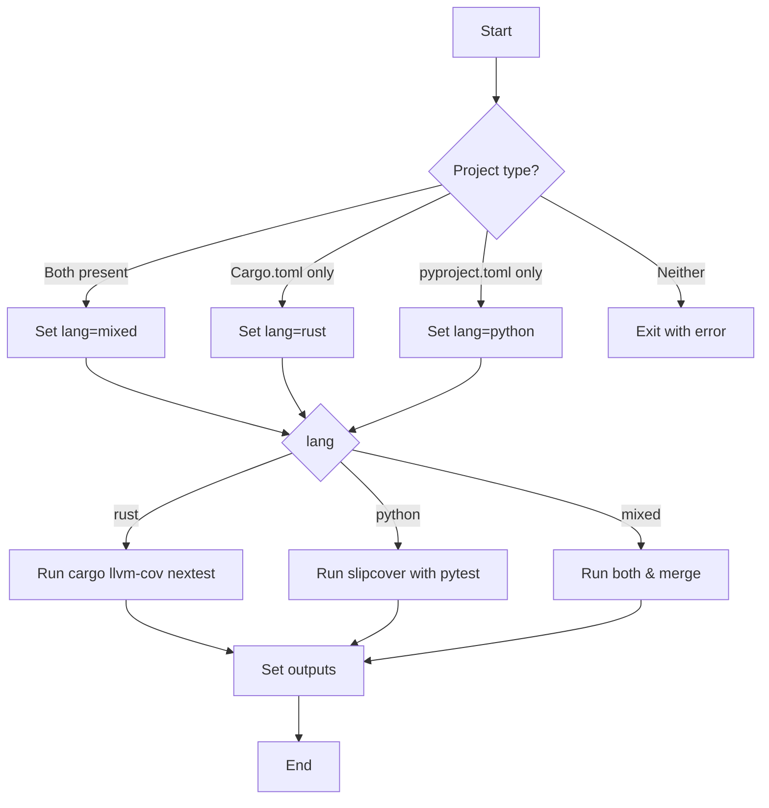
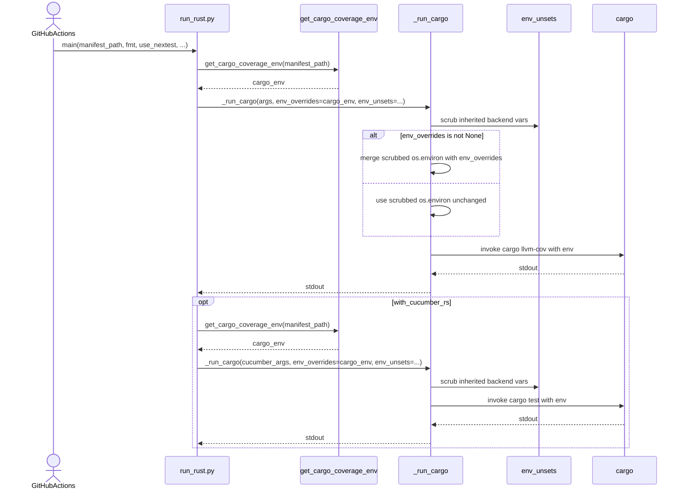

# Generate coverage

Run coverage for Rust, Python, or mixed Rust+Python projects.

Run code coverage for Rust projects, Python projects, and mixed Rust + Python
projects. The action uses `cargo llvm-cov` (with `cargo nextest` by default)
when a `Cargo.toml` is present and `slipcover` with `pytest` when a
`pyproject.toml` is present. If the repository root does not contain a Cargo
manifest, set `cargo-manifest` to point to a nested `Cargo.toml`. It installs
the project dependencies plus `slipcover`, `pytest`, and `coverage`
automatically via `uv` into an isolated throwaway virtual environment
(`.venv-coverage`) before running the tests, so no system-level Python installs
are required. When Rust coverage is required, `cargo-llvm-cov` is installed via
a pinned `cargo-binstall`. `cargo-nextest` is downloaded directly from its
pinned official release; both the archive and extracted binary have fixed
SHA-256 digests, and no Cargo source-build fallback exists. If both
configuration files are present, coverage is run for each language and the
Cobertura reports are merged using `uvx merge-cobertura`.

## Flow


```mermaid
flowchart TD
    A[Start] --> B{Project type?}
    B -- Both present --> C[Set lang=mixed]
    B -- Cargo.toml only --> D[Set lang=rust]
    B -- pyproject.toml only --> E[Set lang=python]
    B -- Neither --> F[Exit with error]
    C --> G{lang}
    D --> G
    E --> G
    G -- rust --> H[Run cargo llvm-cov nextest]
    G -- python --> I[Run slipcover with pytest]
    G -- mixed --> J[Run both & merge]
    H --> K[Set outputs]
    I --> K
    J --> K
    K --> L[End]
```

## Rust coverage environment propagation

Figure: sequence diagram showing how `run_rust.py` derives coverage-specific
Cargo environment overrides for Cranelift-configured projects and passes them
into `_run_cargo`, including the optional cucumber.rs follow-up run. Internally
`_run_cargo` starts from the current process environment, removes inherited
codegen-backend-related variables first, and then merges
`get_cargo_coverage_env(manifest_path)` on top so workflow-level Cranelift
exports are not treated as the default coverage behaviour.

<!-- markdownlint-disable MD013 -->

```mermaid
sequenceDiagram
    actor GitHubActions
    participant run_rust_py as run_rust.py
    participant get_cargo_coverage_env
    participant _run_cargo
    participant env_unsets
    participant cargo

    GitHubActions->>run_rust_py: main(manifest_path, fmt, use_nextest, ...)
    run_rust_py->>get_cargo_coverage_env: get_cargo_coverage_env(manifest_path)
    get_cargo_coverage_env-->>run_rust_py: cargo_env
    run_rust_py->>_run_cargo: _run_cargo(args, env_overrides=cargo_env, env_unsets=...)
    _run_cargo->>env_unsets: scrub inherited backend vars
    alt env_overrides is not None
        _run_cargo->>_run_cargo: merge scrubbed os.environ with env_overrides
    else
        _run_cargo->>_run_cargo: use scrubbed os.environ unchanged
    end
    _run_cargo->>cargo: invoke cargo llvm-cov with env
    cargo-->>_run_cargo: stdout
    _run_cargo-->>run_rust_py: stdout

    opt with_cucumber_rs
        run_rust_py->>get_cargo_coverage_env: get_cargo_coverage_env(manifest_path)
        get_cargo_coverage_env-->>run_rust_py: cargo_env
        run_rust_py->>_run_cargo: _run_cargo(cucumber_args, env_overrides=cargo_env, env_unsets=...)
        _run_cargo->>env_unsets: scrub inherited backend vars
        _run_cargo->>cargo: invoke cargo test with env
        cargo-->>_run_cargo: stdout
        _run_cargo-->>run_rust_py: stdout
    end
```
<!-- markdownlint-enable MD013 -->

## Cranelift codegen backend support

The action automatically detects when a Rust repository configures the
Cranelift codegen backend in `.cargo/config.toml`, `.cargo/config`, or the
selected `Cargo.toml` profile sections. You do not need to enable a separate
input for this behaviour.

When Cranelift is detected, coverage runs set
`CARGO_PROFILE_DEV_CODEGEN_BACKEND=llvm` and
`CARGO_PROFILE_TEST_CODEGEN_BACKEND=llvm` as environment overrides before
launching `cargo-llvm-cov`. That ensures nested `cargo` processes inherit LLVM,
which is required by `-Cinstrument-coverage`. Normal non-coverage builds are
not changed by the action.

For a Cranelift-configured repository, the standard coverage invocation is
still enough:

```yaml
- uses: ./.github/actions/generate-coverage
  with:
    output-path: coverage.xml
    format: cobertura
```

```yaml
- uses: leynos/shared-actions/.github/actions/generate-coverage@v1
  with:
    output-path: coverage.xml
    format: cobertura
```

Known limitations:

- Profile sections in the workspace root `Cargo.toml` are only detected when
  `cargo-manifest` points to the workspace root manifest. If `cargo-manifest`
  points to a workspace member, Cranelift configured solely in the workspace
  root manifest profile will not be detected; use `.cargo/config.toml` in that
  case.
- Detection uses two approaches: `.cargo/config.toml` and `.cargo/config`
  scanning remains text/regex-based, and selected `Cargo.toml` profile
  detection also uses a lightweight text scan.

## Inputs

<!-- markdownlint-disable MD013 -->
| Name                  | Description                                                                                                                                                                                        | Required | Default                     |
| --------------------- | -------------------------------------------------------------------------------------------------------------------------------------------------------------------------------------------------- | -------- | --------------------------- |
| features              | Enable Cargo (Rust) features; space- or comma-separated.                                                                                                                                           | no       |                             |
| with-default-features | Enable default Cargo features (Rust)                                                                                                                                                               | no       | `true`                      |
| all-features          | Pass `--all-features`. Supersedes `with-default-features`; rejected alongside a non-empty `features` list.                                                                                         | no       | `false`                     |
| all-targets           | Pass `--all-targets` so benches, examples, and every test target run under coverage.                                                                                                               | no       | `false`                     |
| doctests              | Run `cargo test --doc --workspace` after the instrumented run, uninstrumented.                                                                                                                     | no       | `false`                     |
| language              | Coverage language scope: `auto`, `rust`, `python`, or `mixed`. `auto` keeps manifest-based detection; explicit values force the scope and fail fast when its prerequisites are missing. See below. | no       | `auto`                      |
| cargo-manifest        | Optional path to Cargo.toml if root Cargo.toml is missing                                                                                                                                          | no       |                             |
| use-cargo-nextest     | Use cargo-nextest for Rust coverage runs (default); set to `false` to use `cargo llvm-cov` directly                                                                                                | no       | `true`                      |
| output-path           | Output file path                                                                                                                                                                                   | yes      |                             |
| format                | Formats: `lcov`*, `cobertura`, `coveragepy`*                                                                                                                                                       | no       | `cobertura`                 |
| with-ratchet          | Fail if coverage drops more than 1pp below baseline                                                                                                                                                | no       | `false`                     |
| cargo-wait-timeout    | Seconds cargo may run before the watchdog kills it                                                                                                                                                 | no       | `1800`                      |
| publish-baseline      | When the baseline may be published: `auto` or `always`                                                                                                                                             | no       | `auto`                      |
| artefact-name-suffix  | Additional suffix appended to the uploaded coverage artefact                                                                                                                                       | no       |                             |
| baseline-rust-file    | Rust baseline path                                                                                                                                                                                 | no       | `.coverage-baseline.rust`   |
| baseline-python-file  | Python baseline path                                                                                                                                                                               | no       | `.coverage-baseline.python` |
| with-cucumber-rs      | Run cucumber-rs scenarios under coverage                                                                                                                                                           | no       | `false`                     |
| cucumber-rs-features  | Path to cucumber feature files                                                                                                                                                                     | no       |                             |
| cucumber-rs-args      | Extra arguments for cucumber                                                                                                                                                                       | no       |                             |
| pytest-workers        | Value passed to pytest-xdist's `-n` flag. Accepts a positive integer, `auto`, `logical`, or `""` (empty) to disable parallelism.                                                                   | no       | `auto`                      |
| cache-provider        | Use the built-in `github` Cargo and uv caches, or `external` when the caller mounts one cache owner.                                                                                               | no       | `github`                    |
<!-- markdownlint-enable MD013 -->

\* `lcov` is only supported for Rust projects, while `coveragepy` is only
supported for Python projects. Mixed projects must use `cobertura`.

### Upgrading

Everything described in this section is additive within `v1`. `all-features`,
`all-targets`, and `doctests` all default to off, and the ratchet baseline
cache change is internal to the action, so a workflow already on `v1` needs no
edit to keep its current behaviour. Opt in only when the coverage job must
replace a separate test job.

### Running coverage as the only test execution

`all-features`, `all-targets` and `doctests` exist so one coverage job can be a
repository's entire test run, rather than a second execution alongside a
separate test job. All three default to off, so existing callers are unaffected.

```yaml
- uses: ./.github/actions/generate-coverage
  with:
    output-path: coverage.xml
    all-features: 'true'
    all-targets: 'true'
    doctests: 'true'
```

`all-features` takes precedence over the narrower feature inputs. It supersedes
`with-default-features`, so `--no-default-features` is not passed and a warning
is logged if the two disagree. Setting it together with a non-empty `features`
list fails the step: `--all-features` already enables everything the list could
name, and accepting both would misreport a narrower set as measured when a
wider one ran.

`all-targets` does not cover doc tests, which are a separate Cargo target kind.
`doctests` runs them afterwards through `cargo test --doc --workspace` with the
same feature selection. That run is uninstrumented and contributes no coverage,
because `cargo llvm-cov`'s nextest path cannot execute doc tests; it is there
to make the doc tests fail the job when they break.

`RUSTFLAGS` from the calling workflow is inherited by every Cargo invocation
the action makes, so a job that exports `-D warnings` gets warnings denied
throughout, including the doc-test run.

### Caching

With the default `cache-provider: github`, setup-uv retains its historical
automatic policy: its GitHub cache is enabled on GitHub-hosted runners and
disabled on self-hosted runners. The action also caches Cargo artefacts and
Python dependencies with `actions/cache`. The Cargo cache covers the
`cargo-binstall`, `cargo-llvm-cov`, and `cargo-nextest` binaries, the Cargo
registry, and the Cargo Git index. It no longer archives the `target` tree.

Coverage builds an instrumented `target/llvm-cov-target` tree, whereas lint and
test builds use a debug or dev-fast tree built with Cranelift and linked with
mold. Archiving either tree captures one shape and invalidates on almost every
change. sccache carries the compiler output across both shapes instead, keying
entries by compiler flags so the two never collide. Whitaker run 33744418209
(coverage under `-C instrument-coverage`) and Cuprum run 33677926269
(Cranelift-built Whitaker lints) each report `Non-cacheable compilations 0`.

Coverage keeps the LLVM codegen backend because `-C instrument-coverage` has no
Cranelift equivalent, so an instrumented build cannot use the Cranelift
backend. mold remains usable as the linker for coverage builds.

Set `cache-provider: external` when the caller mounts those Rust and uv cache
paths through one external cache service, such as a Namespace cache volume.
External mode disables the action's setup-uv cache and its Cargo and Python
dependency cache steps; it does not mount a replacement. The caller must mount
the external cache before dependencies are installed or coverage runs, so each
path has exactly one cache owner. Ratchet baseline restore and save remain
GitHub caches because their paths are outside the Namespace Rust and uv mounts.
They use the `actions/cache/restore` and `actions/cache/save` sub-actions
rather than the full action, so only the save step writes the baseline key.
Both halves report a bounded outcome in the log and job summary, and each is
also emitted as a fixed `metric ratchet-cache.restore=<state>` or
`metric ratchet-cache.save=<state>` line for log scrapers.

```yaml
- uses: ./.github/actions/generate-coverage
  with:
    cache-provider: external
    output-path: coverage.xml
```

The action writes a bounded `hit`, `miss`, `disabled`, or `error` observation
for each archive cache to the workflow log and job summary. External cache hit
telemetry remains the caller's responsibility because this action does not
mount that cache.

### cargo-nextest installation

`cargo-nextest` is downloaded directly from its pinned official release rather
than through `cargo-binstall`, so a compromised or redirected download cannot
substitute an arbitrary archive: both the archive and the extracted executable
are verified against SHA-256 digests pinned in the installer script, and the
download is capped at 200 MB so a redirected or compromised endpoint cannot
fill the runner's disk before that digest check runs. When an already-verified
binary is reused, or when a fresh one is installed, its directory is prepended
to `PATH` and `GITHUB_PATH` so later steps resolve it even when `CARGO_HOME`
points somewhere non-standard; installation fails loudly if an unverified
binary would still shadow it afterwards.

The installer reports each step to the job summary as a bounded
`cargo-nextest.` metric, mirroring the Whitaker action:

```text
cargo-nextest.download=ok duration_seconds=1.204 bytes=2469093
cargo-nextest.archive-digest=ok
cargo-nextest.binary-digest=ok
cargo-nextest.install=ok
```

A reused, already-verified binary instead reports
`cargo-nextest.binary-digest=ok` and `cargo-nextest.install=reused`, without a
download or a fresh archive-digest check.

### Selecting the coverage language

By default (`language: auto`) the action infers the scope from the manifests
present: a root `Cargo.toml` means Rust, a root `pyproject.toml` means Python,
and both together mean mixed. This inference treats *any* `pyproject.toml` as a
Python project, including a configuration-only one that exists solely to hold
tooling settings (for example Ruff, Pylint, or ty) with no `[project]` table.

Set `language` explicitly to force the scope and skip that inference:

- `rust` requires a resolved Cargo manifest (root `Cargo.toml` or
  `cargo-manifest`) and **ignores** a configuration-only `pyproject.toml`.
- `python` requires a syncable `pyproject.toml` with a `[project]` table (the
  prerequisite for the action's `uv sync`).
- `mixed` requires both of the above.

Explicit values fail fast with a clear error when their prerequisites are
absent.

Use `language: rust` for a Rust repository that keeps a tooling-only
`pyproject.toml` (so `auto` would otherwise misclassify it as mixed and reject
`lcov`):

```yaml
- uses: leynos/shared-actions/.github/actions/generate-coverage@v1
  with:
    language: rust
    output-path: lcov.info
    format: lcov
```

## When the baseline is published

In the default `auto` mode the save runs only on a `push` to `refs/heads/main`.
A `workflow_dispatch` never publishes, and neither does a push to any other
branch. `publish-baseline: always` lifts both restrictions.

A dispatch is how warm-cache evidence is gathered, by re-running a workflow
over an unchanged tree; a run that publishes disturbs the generation it was
measuring, and adds a cache entry rather than replacing one, because the key
names the run. A push to a branch other than the trunk would advance the
baseline that later pull requests are measured against, which is a correctness
question rather than housekeeping.

Set `publish-baseline: always` when a repository's merges fire no `push` event,
because they land through an automerge token, or when its trunk is not called
`main`. The calling workflow is then responsible for restricting the job to the
runs that should publish, since the action no longer is. Any value other than
`auto` or `always` is refused by the action's first step, before it restores
anything, rather than being treated as `auto`: a typo would otherwise stop
publication silently and leave later runs comparing against a baseline that had
stopped advancing.

## The cargo watchdog

`cargo` is run under a watchdog that kills it after `cargo-wait-timeout`
seconds, defaulting to 1800. The watchdog is there to catch a hang, and its
budget is sized so that a build which is merely cold does not look like one.

That distinction is the whole reason for the number. A lane that archives its
`target` tree runs a mostly incremental instrumented build, and a few hundred
seconds covers little more than test execution. A lane that has stopped
archiving `target` and let sccache own compiler output, which is the direction
this estate has moved, does the entire instrumented compile inside this budget
on the first run of a branch and after every cache eviction. Netsuke's first
trunk run after that change finished all 2,790 of its tests at about 512
seconds and was killed at 600, during report generation, with sccache serving
333 of 2,336 requests. Nothing was wrong with the build; it was cold.

The budget is reported before cargo starts, as
`cargo watchdog budget: <seconds>s`, and an expiry names both the budget and
how to raise it. Raise the input for a slower suite. Lower it only when a hang
must be caught sooner than the build can legitimately finish, and know that you
are trading a false failure for a faster one.

When it expires, the step prints:

```text
::error::cargo did not exit within <budget>s; killing. This is a budget, not a
detected hang: raise the cargo-wait-timeout input, or
RUN_RUST_CARGO_WAIT_TIMEOUT, if the build is legitimately slower. A cold
sccache store makes the first run on a branch compile everything inside this
budget.
```

Take that at its word. Nothing was detected as hung. A budget expired, and on a
cold compiler cache that is the expected outcome rather than a symptom.

### Sizing the budget against the timers around it

The watchdog is one of four timers that can end a test run, and it is the one
nobody expects because nothing in a caller's `.config/nextest.toml` mentions
it. They only work if each sits above the one inside it.

| Tier | What it bounds | Where a caller sets it |
| --- | --- | --- |
| Per-test `slow-timeout` | one test | `.config/nextest.toml` |
| nextest `global-timeout` | the whole test run | `.config/nextest.toml` |
| This watchdog | one `cargo` invocation, wall clock | `cargo-wait-timeout`, or `RUN_RUST_CARGO_WAIT_TIMEOUT` |
| Job `timeout-minutes` | the whole job | the job holding the coverage step |

Comparing the configured numbers is not enough because the four clocks do not
start together and do not cover the same work.

- **The watchdog starts when `cargo` starts**, so it covers the build as well
  as the test run. nextest's global timeout starts only once tests begin. A
  watchdog merely larger than the global timeout still pre-empts it whenever
  the build takes longer than the difference.
- **A run that hits the global timeout does not stop instantly.** nextest
  follows its usual termination procedure: on Unix it signals the process group
  and waits a grace period, ten seconds by default and set by
  `slow-timeout.grace-period`, before killing it. On Windows termination is
  immediate and the grace period is ignored for timeouts.
- **The job timer starts when the job starts**, before the formatting, linting
  and other steps that precede coverage, and it is still running through
  whatever follows.

So the rule has three terms on each side:

```text
watchdog     >= nextest global-timeout + termination allowance + cold build
job ceiling  >= watchdog + measured work outside the watchdog's window
```

A caller states both allowances, where it measured them, and how many runs it
read. One run is not a measurement of the cold case, it is the coldest run seen
so far, and the difference matters: rstest-bdd's allowances were sized three
times from successive "cold" runs of 22, 30 and finally 42 minutes, each of
which had looked like the worst until the next one arrived. Take the allowance
from the worst of several, and say how many were read, so the next person
sizing it knows what the number rests on.

The failure this prevents is not hypothetical. rstest-bdd had a 30-minute
watchdog under a 75-minute nextest budget; on 2026-09-05 a dependabot bump
served 9 % of Rust compile requests from cache and was killed at 1,800 s with
1,894 of its 1,897 tests complete. The run immediately before it took 1,833 s
and passed, because the watchdog times `cargo` rather than the step. That lane
was not near its budget, it was straddling it, and whether a run survived was
decided by a few seconds of job setup.

The job ceiling matters as much as the watchdog, and is easier to forget. On a
genuinely cold run of that same lane the coverage step took 42 minutes and the
whole job took 1 h 50 m, because the work either side of coverage ran cold too:
37 minutes before and 31 after, against 14 and 37 on a warmer run. A larger
watchdog alone would not have saved it. The job would have been cancelled at
its 90-minute ceiling, and a cancellation discards the log that explains the
overrun.

### Asserting the ordering

A comment goes stale; a contract does not. Consumers that carry this mechanism
assert the ordering by value, and two details of that shape are worth copying
rather than reinventing.

**Enumerate every step that invokes this action**, not only the steps that
already set a budget. A contract that reads the variable where it finds it will
pass when a step loses its override, and that step silently inherits the 1,800
second default.

**Compare the job ceiling per job**, not against the tightest
`timeout-minutes` in the file. An unrelated job's ceiling has nothing to say
about the coverage lane's, and comparing them either fails an honestly sized
job or forces unrelated budgets to move together.

Take the termination allowance from `slow-timeout.grace-period` where a
repository sets one, rather than assuming the ten-second default. Scan both
`*.yml` and `*.yaml`: a coverage lane in the other extension
would otherwise inherit the default without failing anything.

One portability note, because this contract gets copied. Module-level
annotations are evaluated at import below Python 3.14 and deferred from 3.14
onwards, so a `Path` used in a module constant's annotation must be imported at
runtime in a repository on the older baseline, and may live in a type-checking
block in one on the newer.

`RUN_RUST_CARGO_WAIT_TIMEOUT` takes precedence over the input, for a caller
setting one budget at job level across several steps. The action passes the
input to the script under its own name rather than as that variable, so a step
does not clobber a job-level budget with this input's default.

A source that is empty, or contains only whitespace, counts as unset and falls
through to the next one, then to the default. An action input a caller does not
set arrives as an empty string rather than an absent variable, so this is the
ordinary case, not an edge one.

A source that does name a value must name a finite number of seconds greater
than zero. A watchdog that cannot expire is not a watchdog: a `nan` budget
never fires, an infinite one falls through to the platform's own timeout, and a
non-positive one kills a healthy build at once. Anything else is refused before
cargo is spawned, naming the source that supplied it.

## Outputs

| Name   | Description                                     |
| ------ | ----------------------------------------------- |
| file   | Path to the generated coverage file             |
| format | Format of the coverage file                     |
| lang   | Detected language (`rust`, `python` or `mixed`) |

## Example

```yaml
- uses: ./.github/actions/generate-coverage
  with:
    output-path: coverage.xml
    format: cobertura
```

```yaml
- uses: leynos/shared-actions/.github/actions/generate-coverage@v1
  with:
    output-path: coverage.xml
    format: cobertura
```

For a single feature:

```yaml
- uses: ./.github/actions/generate-coverage
  with:
    output-path: coverage.xml
    features: logging
```

For multiple features:

```yaml
- uses: ./.github/actions/generate-coverage
  with:
    output-path: coverage.xml
    features: logging tracing
    with-default-features: false
```

Comma-separated feature list:

```yaml
- uses: ./.github/actions/generate-coverage
  with:
    output-path: coverage.xml
    features: logging,tracing
```

Enable ratcheting:

```yaml
- uses: ./.github/actions/generate-coverage
  with:
    output-path: coverage.xml
    with-ratchet: true
```

The ratchet compares the current coverage against a stored baseline within a
provisional symmetric ±1 percentage-point dead-band. Coverage within one
absolute percentage point of the baseline is treated as noise: the run passes
and the baseline is held. A drop of more than one point below the baseline
fails the run; a rise of more than one point above the baseline advances the
baseline. Under the default `publish-baseline: auto`, only a push to
`refs/heads/main` persists the advanced baseline to the Actions cache; every
run restores it, so the baseline tracks the latest trunk coverage.

Enable cucumber-rs:

```yaml
- uses: ./.github/actions/generate-coverage
  with:
    output-path: coverage.xml
    with-cucumber-rs: true
    cucumber-rs-features: tests/features
    cucumber-rs-args: "--tag @ui"
```

Disable cargo-nextest:

```yaml
- uses: ./.github/actions/generate-coverage
  with:
    output-path: coverage.xml
    use-cargo-nextest: false
```

Run pytest serially (disable pytest-xdist):

```yaml
- uses: ./.github/actions/generate-coverage
  with:
    output-path: coverage.xml
    pytest-workers: ""
```

### Parallel Python tests via pytest-xdist

Python coverage runs through `pytest-xdist` by default
(`pytest-workers: auto`), and slipcover 1.0.18+ merges the per-worker coverage
transparently. Set `pytest-workers` to a positive integer for a fixed worker
count, to `logical` to use the logical central processing unit (CPU) count, or
to `""` to keep the historical serial behaviour.

> [!WARNING]
> **Co-located tests + `--omit` regression in slipcover xdist workers.**
> slipcover 1.0.18's xdist plugin does not propagate `--omit` to worker
> processes. Projects that lay tests **inside** the source package (e.g.
> `mypkg/unittests/test_*.py`, relying on
> `--source=./mypkg --omit="*/unittests/*"`) will see their reported line-rate
> drop sharply once xdist is enabled because the co-located test files are
> reported at 0% coverage. The production-code coverage values themselves are
> unchanged; only the omit list is dropped on the worker side. Projects that
> keep tests **outside** the source package (e.g. `tests/` next to
> `src/mypkg/`) are unaffected. Projects that rely on `--omit` to exclude
> in-package tests should either move the tests out of the package or set
> `pytest-workers: ""` until the upstream plugin is fixed.

Use a nested Cargo manifest:

```yaml
- uses: ./.github/actions/generate-coverage
  with:
    output-path: coverage.xml
    cargo-manifest: rust-toy-app/Cargo.toml
```

The action prints the current coverage percentage to the log. When
``with-ratchet`` is enabled and a baseline file is present, the previous
percentage is shown as well.

Coverage reports are archived as workflow artefacts named
``<format>-<job>-<index>-<os>-<arch>`` by default. When `artefact-name-suffix`
is provided, the suffix is appended after the `<os>-<arch>` segment. This
prevents collisions across matrix jobs and distinguishes runs on different
platforms.

The archive step always runs, including after a ratchet gate trips, so a
coverage report is captured even for a failing run. The name is computed by a
step that also always runs; if that step cannot compute one, the archive falls
back to a run-scoped ``coverage-<job>-<index>-<run-id>`` name. This ensures a
failing run surfaces its real error (for example, "Coverage decreased") rather
than a confusing empty-artefact-name error from the upload.

Developer-facing design notes, including the rationale for Cranelift coverage
environment overrides, are available in
[`docs/generate-coverage-design.md`](../../../docs/generate-coverage-design.md).

Release history is available in [CHANGELOG](CHANGELOG.md).
