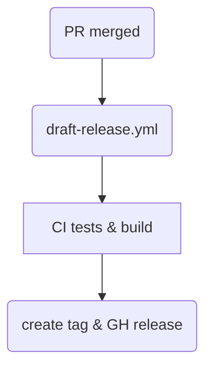

# Instructions for Agents

<!-- markdownlint-disable MD013 MD004 -->

> **Audience**: Contributors and maintainers of this repository.\
> **Scope**: Standards and workflows for creating, versioning, testing,
> releasing and deprecating GitHub Actions that live **inside this monorepo**.

## 1  Repository Layout

```text
shared-actions/
├── .github/workflows/     # CI for the actions themselves
└── .github/actions/       # One directory per action
    ├── <action‑name>/
    │   ├── action.yml     # Action metadata (single source of truth)
    │   ├── README.md      # Usage, inputs/outputs, examples
    │   ├── src/           # Implementation (TS/JS/sh/composite)
    │   ├── tests/         # Unit & integration tests
    │   └── CHANGELOG.md   # SemVer‑based changelog **for this action only**
    └── …
```

### Why this shape?

- **Co‑location** of tests, docs and code encourages completeness.

- Keeps unrelated actions quarantined from one another—no shared state except
  at repo root.

## 2  Creating a New Action

1. **Choose the right runtime**

   - Prefer **TypeScript** for anything non‑trivial—typed, testable, packaged
     with `@actions/toolkit`.

   - Use **composite** actions for simple orchestration or shell snippets.

   - Reserve **docker** actions for cases that truly need containers (e.g.
     bundling CLI tools).

2. Scaffold:

   ```bash
   npx @actions/create-action
   mv <name> .github/actions/
   
   ```

3. Complete the template:

   - Fill in `action.yml` with *every* input & output; mark required ones
     clearly.

   - Populate **example usage** block—copy‑paste runnable.

   - Write/update **tests** (see §4).

4. **Open a PR** labelled `action:<name>`; two reviews required.

## 3  Versioning & Tagging Strategy

| Concept                 | Rule                                                                           |
| ----------------------- | ------------------------------------------------------------------------------ |
| **Semantic Versioning** | Each action follows **SemVer 2.0.0** independently.                            |
| **Tag format**          | `⟨action‑name⟩‑vX.Y.Z` (e.g. `lint-check-v1.3.0`).                             |
| **Mutable major tags**  | Create/force‑update `⟨action‑name⟩‑vX` on release.                             |
| `main` **branch**       | Head of active development; *never* consumed directly by downstream workflows. |

Release flow:



`draft‑release.yml` can be manually triggered to bump the version; it
auto‑increments patch unless `release‑type` input overrides (`minor`, `major`).

## 4  Testing & CI

- **Unit tests**: Jest (TS) or Bats‑core (shell). Must cover:

  - Happy path

  - Common edge cases

  - Failure modes with clear error messages

- **Contract tests**: Validate that declared **inputs/outputs** round‑trip
  correctly.

- **Integration smoke test**: Run via `nektos/act` in CI for the matrix
  `ubuntu-latest`, `macos-latest` (where feasible).

- **Coverage gate**: Keep ≥ 80 % branch coverage.

- **Static analysis**: ESLint + prettier + `@typescript-eslint` presets.

CI workflow lives at `.github/workflows/ci.yml` and runs on PR and nightly via
schedule.

## 5  Security Hardening

1. **Pin third‑party actions** to a full commit SHA (not just `@v1`).

2. Request the **minimum permission set** (`permissions:` block) and avoid
   `GITHUB_TOKEN` write unless essential.

3. Run **CodeQL** weekly; treat alerts as CI failures.

4. No secrets in the repo; use `secrets:` in workflow or environment‑protected
   variables.

5. Validate all user‑supplied input—never `eval`/`exec` raw parameters.

## 6  Documentation Standards

- Each action [**README.md**](http://README.md) must contain:

  - **One‑liner summary**

  - **Table of Inputs** (name, type, default, description, required?)

  - **Table of Outputs**

  - **Usage example** with `uses: ./.github/actions/<name>@<major>`

  - **Release history** link to CHANGELOG

- Keep root‑level `README.md` updated with a table of published actions and
  latest majors.

## 7  Deprecation & Removal

1. Open an issue labelled `deprecation` with: rationale, EOL date (≥ 90 days),
   suggested replacement.

2. Add a `DEPRECATED:` banner to README and repository description.

3. Merge a final release that prints a **warning** but remains functional until
   EOL.

4. After EOL: archive directory in `.github/actions‑graveyard/` and delete tags.

## 8  Maintenance & Ownership

| Responsibility     | Minimum cadence                        |
| ------------------ | -------------------------------------- |
| Issue triage       | Weekly                                 |
| Dependency updates | Dependabot auto‑merge on green tests   |
| Release notes      | Included in every tag / GH Release     |
| Security audit     | Quarterly                              |

Each action’s `CODEOWNERS` entry must name **at least one** current maintainer.

## 9  Gotchas & Tips

- **Composite actions & path context** – When referencing sibling scripts, use
  `“${{ github.action_path }}”` for portability.

- **Clock drift** – Don’t rely on system time. Use `GITHUB_RUN_ATTEMPT` or the
  API for deterministic IDs.

- **Token boundary** – Remember that job‑level `permissions:` **override**
  workflow‑level. Audit both.

## 10  References

- GitHub Actions docs – <https://docs.github.com/actions>

- GitHub Marketplace publishing guide –
  <https://docs.github.com/actions/creating-actions/publishing-actions-in-github-marketplace>

- "Reusable Workflows vs Actions" blog post –
  <https://github.blog/changelog/2022-08-03-reusable-workflows-ga/>

For Python development, refer to the detailed guidelines in the `.rules/`
directory:

* [Python Code Style Guidelines](.rules/python-00.md) - Core Python 3.13 style
  conventions
* [Python Context Managers](.rules/python-context-managers.md) - Best practices
  for context managers
* [Python Generators](.rules/python-generators.md) - Generator and iterator
  patterns
* [Python Project Configuration](.rules/python-pyproject.md) - pyproject.toml
  and packaging
* [Python Exception Design, Raising, Handling and Logging](.rules/python-exception-design-raising-handling-and-logging.md)
  - Exceptions and logging patterns
* [Python Return Patterns](.rules/python-return.md) - Function return
  conventions
* [Python Typing](.rules/python-typing.md) - Type annotation best practices

Additional docs:

* [Scripting Standards](docs/scripting-standards.md) - Guidance for writing
  robust scripts used by actions

______________________________________________________________________

Maintainers are encouraged to keep this Codex up to date. Pull requests welcome.
