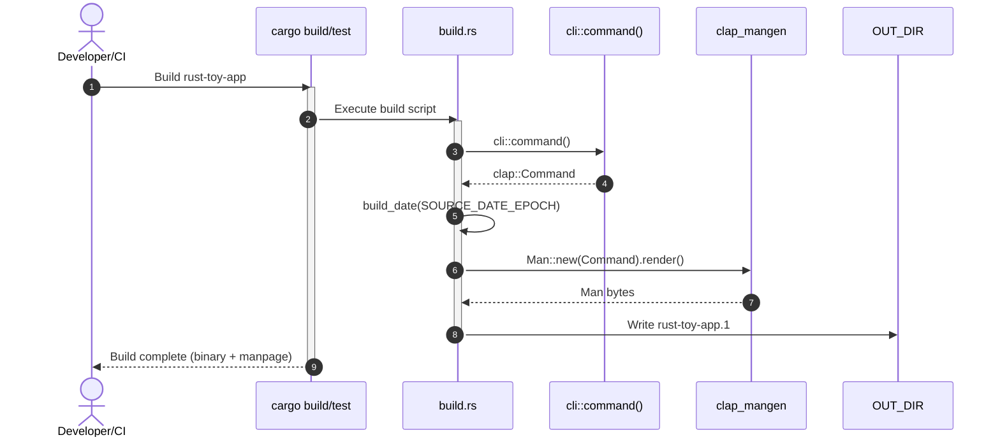

# Design: A Modernized, Declarative Rust Build and Release Pipeline

## 1. System Goals

This document outlines a unified, modern design for a reusable Rust build and
release pipeline, intended for implementation within the `shared-actions`
repository and consumption by projects such as `netsuke`. The system's primary
goal is to replace the previous architecture, which relied on imperative Python
scripts, with a declarative, tool-centric workflow.

## 2. High-Level Architecture: Configuration as Code

The new architecture embraces the principle of "Configuration as Code". The
responsibility for *how* to build and package software is delegated to
specialized tools, while the developer's intent—*what* to build—is captured in
declarative configuration files.

This pipeline is composed of three core, best-in-class tools:

1. **`cross`**: A zero-setup cross-compilation tool for Rust. It transparently
   manages containerized build environments (via Docker or Podman) to provide
   the correct C toolchains, linkers, and system libraries for any given target
   triple.
2. **`clap_mangen`**: A utility for generating UNIX manual pages directly from
   a `clap`-based CLI definition. It is integrated into the build process via a
   `build.rs` script to ensure documentation is always synchronized with the
   application's interface.
3. **GoReleaser**: A powerful, multi-format release automation tool. It reads a
   single `.goreleaser.yaml` file to create archives (`.tar.gz`), Linux
   packages (`.deb`, `.rpm`), and other formats, as well as checksums and
   GitHub Releases.

Any necessary "glue" logic will be implemented in self-contained Python scripts
that use `uv` and PEP 723 to manage their dependencies, removing the need
for `actions/setup-python` in consuming workflows.

The workflow proceeds in two distinct stages:

1. **Build Stage**: A parallelized matrix job that uses `cross` to compile the
   Rust binary and its associated man page for each target platform. The
   resulting artifacts are uploaded for the next stage.
2. **Release Stage**: A single job that downloads all build artifacts, then
   orchestrates GoReleaser to package them into archives and distribution
   formats before creating a GitHub Release.

## 3. Detailed Component Design for Implementers

### 3.1 Build Stage: Cross-Compilation and Man Page Generation

The build stage is responsible for producing compiled binaries and
documentation. This is accomplished within a matrix job in the GitHub Actions
workflow.

#### 3.1.1 Cross-Compilation with `cross`

The primary build command will be
`cross build --release --target ${{ matrix.target }}`. The build job matrix
defines the full set of target platforms, including Linux, macOS, and FreeBSD.
macOS targets run on `macos-latest` runners or an image with the Apple SDK
because `cross` cannot build them on Linux. Each matrix entry also declares
`os`, `arch`, and `runs-on` values, so the compiled binary and man page can be
staged under `dist/<project>_<os>_<arch>/` before upload.
This matches the paths expected by GoReleaser.

```yaml
# .github/workflows/release.yml (excerpt)
jobs:
  build:
    strategy:
      matrix:
        include:
          - target: x86_64-unknown-linux-gnu
            os: linux
            arch: amd64
            runs-on: ubuntu-latest
          - target: aarch64-unknown-linux-gnu
            os: linux
            arch: arm64
            runs-on: ubuntu-latest
          - target: x86_64-apple-darwin
            os: darwin
            arch: amd64
            runs-on: macos-latest
          - target: aarch64-apple-darwin
            os: darwin
            arch: arm64
            runs-on: macos-latest
          - target: x86_64-unknown-freebsd
            os: freebsd
            arch: amd64
            runs-on: ubuntu-latest
    runs-on: ${{ matrix.runs-on }}
    steps:
      - uses: actions/checkout@v4
      - name: Setup Rust toolchain
        uses: ./.github/actions/setup-rust
        with:
          toolchain: stable
      - name: Install cross
        if: matrix.os != 'darwin'
        run: cargo install cross --git https://github.com/cross-rs/cross
      - name: Build binary and man page
        run: |
          if [ "${{ matrix.os }}" = "darwin" ]; then
            rustup target add ${{ matrix.target }}
            cargo build --release --target ${{ matrix.target }}
          else
            cross build --release --target ${{ matrix.target }}
          fi
      - name: Stage artifacts
        run: |
          mkdir -p dist/netsuke_${{ matrix.os }}_${{ matrix.arch }}
          cp target/${{ matrix.target }}/release/<binary-name> \
            dist/netsuke_${{ matrix.os }}_${{ matrix.arch }}/
          cp target/${{ matrix.target }}/release/build/<crate-name>-*/out/<manpage-name>.1 \
            dist/netsuke_${{ matrix.os }}_${{ matrix.arch }}/
      - name: Upload artifacts
        uses: actions/upload-artifact@v4
        with:
          name: dist_${{ matrix.os }}_${{ matrix.arch }}
          path: dist/netsuke_${{ matrix.os }}_${{ matrix.arch }}
```

#### 3.1.2 Man Page Generation via `build.rs`

Man page generation will be automated via a `build.rs` script in the consuming
project, using `clap_mangen`.

**`Cargo.toml` Configuration:**

```toml
# In consuming repository (e.g., netsuke/Cargo.toml)
[build-dependencies]
clap = { version = "4", features = ["derive"] }
clap_mangen = "0.2"
time = { version = "0.3", features = ["formatting"] }
```

**`build.rs` Implementation:**

The script must generate the man page into the directory specified by the
`OUT_DIR` environment variable and honour `SOURCE_DATE_EPOCH` for reproducible
builds.

```rust
// In consuming repository (e.g., netsuke/build.rs)
use clap::CommandFactory;
use clap_mangen::Man;
use std::{env, fs, path::PathBuf};
use time::{format_description::well_known::Iso8601, OffsetDateTime};

// Import the CLI definition from the main application crate.
#[path = "src/cli.rs"]
mod cli;

fn main() -> std::io::Result<()> {
    // Rebuild when CLI, manifest, or build logic changes; respect reproducible builds.
    println!("cargo:rerun-if-changed=src/cli.rs");
    println!("cargo:rerun-if-changed=Cargo.toml");
    println!("cargo:rerun-if-changed=build.rs");
    println!("cargo:rerun-if-env-changed=SOURCE_DATE_EPOCH");

    let out_dir = PathBuf::from(
        env::var_os("OUT_DIR")
            .ok_or_else(|| std::io::Error::new(std::io::ErrorKind::NotFound, "OUT_DIR not set"))?,
    );
    let cmd = cli::command();
    let date = env::var("SOURCE_DATE_EPOCH")
        .ok()
        .and_then(|s| s.parse::<i64>().ok())
        .and_then(|ts| OffsetDateTime::from_unix_timestamp(ts).ok())
        .and_then(|dt| dt.format(&Iso8601::DATE).ok())
        .unwrap_or_else(|| "1970-01-01".to_string());
    let man = Man::new(cmd).date(date);
    let mut buffer: Vec<u8> = Default::default();

    man.render(&mut buffer)?;
    fs::write(out_dir.join("netsuke.1"), buffer)?;

    Ok(())
}
```

Figure: Sequence of `build.rs` generating a man page during `cargo build`.



### 3.2 Release Stage: Declarative Packaging with GoReleaser

The release stage uses the `goreleaser/goreleaser-action` to unify packaging.

#### 3.2.1 `.goreleaser.yaml` Configuration

A `.goreleaser.yaml` file defines the release process. It will use GoReleaser's
`prebuilt` builder and its `nfpms` integration for `.deb` and `.rpm`. For macOS
and FreeBSD `.pkg` formats, where native support is lacking, it will use custom
build hooks to invoke system packaging tools.

```yaml
# .goreleaser.yaml
project_name: netsuke
before:
  hooks:
    - test -f dist/netsuke_linux_amd64/netsuke.1
builds:
  - id: netsuke
    builder: prebuilt
    binary: netsuke
    goos:
      - linux
      - darwin
      - freebsd
    goarch:
      - amd64
      - arm64
    prebuilt:
      path: "dist/{{.ProjectName}}_{{.Os}}_{{.Arch}}/netsuke"

archives:
  - id: default
    files:
      - src: "dist/{{.ProjectName}}_{{.Os}}_{{.Arch}}/netsuke"
        dst: "netsuke"
      - src: "dist/{{.ProjectName}}_{{.Os}}_{{.Arch}}/*.1"
        dst: "."
      - LICENSE
      - README.md

checksum:
  name_template: "checksums.txt"

# Native support for Linux packages.
nfpms:
  - id: packages
    package_name: netsuke
    formats:
      - deb
      - rpm
    # ... metadata (maintainer, description, etc.)
    contents:
      - src: "dist/{{.ProjectName}}_{{.Os}}_{{.Arch}}/netsuke"
        dst: /usr/bin/netsuke
      - src: "dist/{{.ProjectName}}_{{.Os}}_{{.Arch}}/*.1"
        dst: /usr/share/man/man1/
```

#### 3.2.2 Release Job Workflow

The release job downloads all artifacts and invokes GoReleaser. Separate steps
will be required on dedicated runners for the custom packaging.

```yaml
# .github/workflows/release.yml (excerpt)
  release:
    runs-on: ubuntu-latest
    needs: build
    permissions:
      contents: write
    steps:
      - uses: actions/checkout@v4
      - name: Download all build artifacts
        uses: actions/download-artifact@v4
        with:
          path: dist
          pattern: dist_*
          merge-multiple: true
      - name: Run GoReleaser
        uses: goreleaser/goreleaser-action@v5
        with:
          version: latest
          args: release --clean
        env:
          GITHUB_TOKEN: ${{ secrets.GITHUB_TOKEN }}
```

### 3.3 Self-Contained Scripting with `uv` and PEP 723

Helper scripts will be self-contained using `uv` and embedded PEP 723
dependency metadata, eliminating the need for `actions/setup-python` in
consumer workflows.

```python
#!/usr/bin/env -S uv run --script
# /// script
# requires-python = ">=3.12"
# dependencies = ["plumbum", "typer"]
# ///
import typer
from plumbum.cmd import cross
# ... script logic ...
```

## 4. Multi-Layered Testing Strategy

### 4.1 Unit Testing

Unit tests for Python scripts will mock the `run_cmd` function to verify that
high-level tools (`cross`, `goreleaser`) are invoked with the correct
arguments. These tests must be executable on a local developer machine without
a CI environment or container runtime.

### 4.2 Local End-to-End (E2E) Testing Harness

A new local testing harness will be created using `pytest`. This harness will:

- Create a temporary directory structure mimicking a GitHub Actions environment.
- Populate it with fixture files (e.g., a toy pre-compiled binary).
- Execute the Python helper scripts against this local environment.
- Use mocks for external commands (`cross`, `goreleaser`, `pkgbuild`) to assert
  they are called with the expected arguments based on the fixture state.

This provides a vital intermediate testing layer between isolated unit tests
and a full CI run.

### 4.3 CI End-to-End (E2E) Testing

The primary validation will occur in the `shared-actions` repository's own CI
workflow, simulating a release of the dedicated `rust-toy-app`.

The E2E test job will:

1. Execute the full workflow using the local, in-repository versions of the
   actions.
2. Download all package artifacts (`.deb`, `.rpm`, `.pkg`).
3. On a Linux runner, install the `.deb` package using `sudo dpkg -i` and
   verify the installation by checking the binary's presence and
   executability, and the man page's accessibility.
4. For other package formats (`.rpm`, `.pkg`), the test will perform an
   inspection (`rpm -qip`, `pkgutil --payload-files`, `pkg info -l`) to verify
   contents and metadata, as a full installation may require a dedicated
   runner OS.

## 5. Implementation Roadmap

### Phase 1: Project Scaffolding and E2E Test Setup

- [x] Create a minimal "toy" Rust application (`rust-toy-app`) within
  `shared-actions`. This app will have a `clap` CLI and a `build.rs` for man
  page generation, serving as the target for all E2E tests.
- [ ] Create a skeleton `rust-build-release`.
- [x] Validate man-page generation via Rust `assert_cmd` integration tests.
- [x] Wire a CI workflow that runs `cargo +1.89.0 test --manifest-path
  rust-toy-app/Cargo.toml` for this crate.

```yaml
# .github/workflows/rust-toy-app.yml
name: rust-toy-app
on: [push, pull_request]
jobs:
  test:
    runs-on: ubuntu-latest
    steps:
      - uses: actions/checkout@v4
      - uses: ./.github/actions/setup-rust
        with:
          toolchain: 1.89.0
      - run: cargo test --manifest-path rust-toy-app/Cargo.toml
```

#### Phase 2 Design Decisions

- The `rust-toy-app` crate exposes a `clap`-based CLI to act as a simple E2E
  test target.
- Man pages are generated in `build.rs` via `clap_mangen`, ensuring the CLI and
  documentation stay synchronized.
- Build script derives the man page date from `SOURCE_DATE_EPOCH` using the
  `time` crate for reproducible output.
- An `assert_cmd` integration test runs `cargo build` and asserts the build
  script emitted a man page under `target/*/build/*/out/` using a glob search.
- The crate provides a `command()` helper returning `clap::Command` for use by the
  build script.
- Testing includes a unit test for greeting logic and an `assert_cmd`
  integration test for the binary.
- A GitHub workflow (`.github/workflows/rust-toy-app.yml`) runs the crate's
  tests on push and pull request using the `setup-rust` action with toolchain `1.89.0`.
- The crate targets Rust 2024 edition and sets `rust-version = 1.89` to define
  the MSRV.
- The crate is not published (`publish = false`) and the build script emits
  `cargo:rerun-if-changed` for `src/cli.rs`, `Cargo.toml`, and `build.rs`,
  plus `cargo:rerun-if-env-changed=SOURCE_DATE_EPOCH`, to regenerate the
  man page when the CLI, metadata, or reproducible-build epoch changes.

### Phase 2: Toolchain Integration and Build Modernization

- [x] Create a `rust-build-release` action using `setup-rust` from this repo and
  `cross`, then integrate this into the CI workflow for a single target:
  `x86_64-unknown-linux-gnu`.
- [x] Ensure the CI workflow verifies that the action generates a man page
  via the build script.
- [x] Validate that a `cross build` command successfully produces both the
  binary and the man page artifact.
- [x] Construct any required Python helper scripts using the self-contained
  `uv` and PEP 723 pattern.
- [x] Enable the Linux aarch64 branch of the CI workflow.

#### Design Decisions

- The `rust-build-release` action is a composite action that first invokes the
  repository’s `setup-rust` action, then installs `cross` if it is absent.
- The action delegates compilation to a Python script (`main.py`) that installs
  `cross` on demand and runs `cross build --release` (falling back to `cargo`
  when no container runtime is available) for the caller-provided target
  triple.
- Workflows select the crate to build via a `project-dir` input because
  `uses:` steps cannot set a `working-directory`.
- CI executes the action against the `rust-toy-app` crate for the
  `x86_64-unknown-linux-gnu` and `aarch64-unknown-linux-gnu` targets,
  validating both the release binary and man page outputs.

### Phase 3: Declarative Packaging and Local Testing

- [x] Create the initial `.goreleaser.yaml` configuration for `.deb` files and
  add the necessary steps to the action to call GoReleaser.
- [ ] Add custom packaging scripts for macOS `.pkg` and FreeBSD `.pkg` and
  integrate them into the action.
- [ ] Develop the local E2E packaging test harness using `pytest` and fixtures
  to validate Python script logic against a simulated file system.

#### Design Decisions

- GoReleaser is invoked via the pinned
  `goreleaser/goreleaser-action@e435ccd777264be153ace6237001ef4d979d3a7a`.
- The `.deb` packages for `amd64` and `arm64` are assembled with GoReleaser's
  `nfpms` using pre-built binaries and generated man pages.
- Snapshot releases skip publishing to enable local testing.

### Phase 4: Full Workflow Automation and CI E2E Testing

- [ ] Provide comprehensive documentation on implementing a full parallel build
  matrix (Linux, macOS, and FreeBSD) and a final, dependent release job.
- [ ] Implement the comprehensive CI E2E testing strategy.
- [ ] Deprecate and remove the legacy `build-rust-binary` and
  `build-rust-package` actions.
